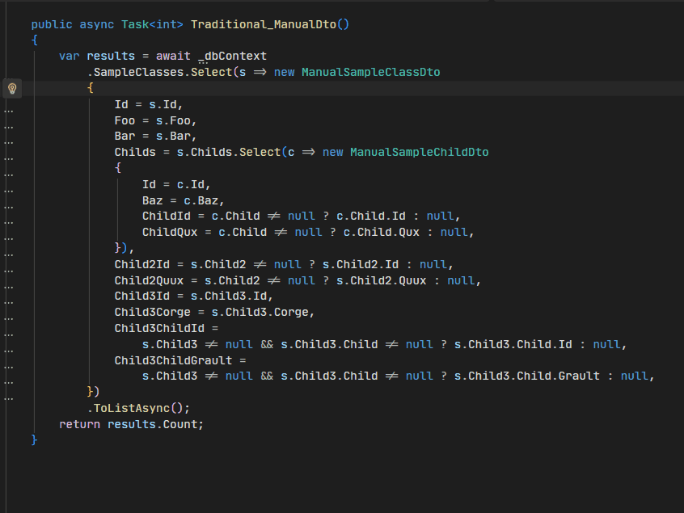
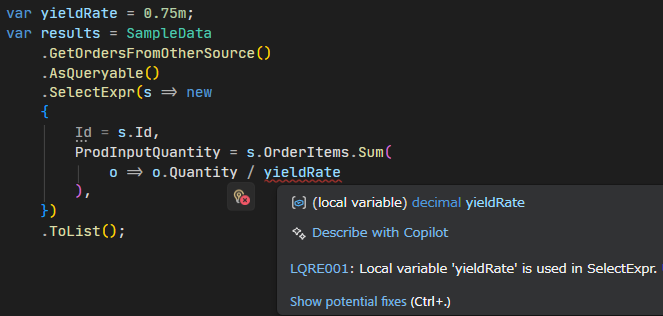

#  Linqraft 

[](https://www.nuget.org/packages/Linqraft/)  [![DeepWiki](https://img.shields.io/badge/DeepWiki-arika0093%2FLinqraft-blue.svg?logo=data:image/png;base64,iVBORw0KGgoAAAANSUhEUgAAACwAAAAyCAYAAAAnWDnqAAAAAXNSR0IArs4c6QAAA05JREFUaEPtmUtyEzEQhtWTQyQLHNak2AB7ZnyXZMEjXMGeK/AIi+QuHrMnbChYY7MIh8g01fJoopFb0uhhEqqcbWTp06/uv1saEDv4O3n3dV60RfP947Mm9/SQc0ICFQgzfc4CYZoTPAswgSJCCUJUnAAoRHOAUOcATwbmVLWdGoH//PB8mnKqScAhsD0kYP3j/Yt5LPQe2KvcXmGvRHcDnpxfL2zOYJ1mFwrryWTz0advv1Ut4CJgf5uhDuDj5eUcAUoahrdY/56ebRWeraTjMt/00Sh3UDtjgHtQNHwcRGOC98BJEAEymycmYcWwOprTgcB6VZ5JK5TAJ+fXGLBm3FDAmn6oPPjR4rKCAoJCal2eAiQp2x0vxTPB3ALO2CRkwmDy5WohzBDwSEFKRwPbknEggCPB/imwrycgxX2NzoMCHhPkDwqYMr9tRcP5qNrMZHkVnOjRMWwLCcr8ohBVb1OMjxLwGCvjTikrsBOiA6fNyCrm8V1rP93iVPpwaE+gO0SsWmPiXB+jikdf6SizrT5qKasx5j8ABbHpFTx+vFXp9EnYQmLx02h1QTTrl6eDqxLnGjporxl3NL3agEvXdT0WmEost648sQOYAeJS9Q7bfUVoMGnjo4AZdUMQku50McDcMWcBPvr0SzbTAFDfvJqwLzgxwATnCgnp4wDl6Aa+Ax283gghmj+vj7feE2KBBRMW3FzOpLOADl0Isb5587h/U4gGvkt5v60Z1VLG8BhYjbzRwyQZemwAd6cCR5/XFWLYZRIMpX39AR0tjaGGiGzLVyhse5C9RKC6ai42ppWPKiBagOvaYk8lO7DajerabOZP46Lby5wKjw1HCRx7p9sVMOWGzb/vA1hwiWc6jm3MvQDTogQkiqIhJV0nBQBTU+3okKCFDy9WwferkHjtxib7t3xIUQtHxnIwtx4mpg26/HfwVNVDb4oI9RHmx5WGelRVlrtiw43zboCLaxv46AZeB3IlTkwouebTr1y2NjSpHz68WNFjHvupy3q8TFn3Hos2IAk4Ju5dCo8B3wP7VPr/FGaKiG+T+v+TQqIrOqMTL1VdWV1DdmcbO8KXBz6esmYWYKPwDL5b5FA1a0hwapHiom0r/cKaoqr+27/XcrS5UwSMbQAAAABJRU5ErkJggg==)](https://deepwiki.com/arika0093/Linqraft)

Write Select queries easily with on-demand DTO generation and null-coalescing operators.

## Features

Linqraft is a Roslyn Source Generator for easily writing `IQueryable` projections with null-propagation and automatic DTO generation.
With Linqraft, you can write queries like this:

```csharp
var orders = await dbContext.Orders
    // Order: input entity type
    // OrderDto: output DTO type (auto-generated)
    .SelectExpr<Order, OrderDto>(o => new
    {
        // can use inferred member names
        o.Id,
        // null-propagation supported
        CustomerName = o.Customer?.Name,
        // also works for nested objects
        CustomerCountry = o.Customer?.Address?.Country?.Name,
        CustomerCity = o.Customer?.Address?.City?.Name,
        // you can use anonymous types inside
        CustomerInfo = new
        {
            Email = o.Customer?.EmailAddress,
            Phone = o.Customer?.PhoneNumber,
        },
        // collections available
        Items = o.OrderItems.Select(oi => new
        {
            // of course, features work here too
            ProductName = oi.Product?.Name,
            oi.Quantity
        }),
    })
    .ToListAsync();
```

By specifying `OrderDto` as the generic parameter for `SelectExpr`, DTO types are generated **automatically** from the anonymous-type selector.
That means **you don't need to manually declare** `OrderDto` or `OrderItemDto`.
for example, the generated code looks like this:

<details>
<summary>Generated code example</summary>

```csharp
// <auto-generated />
#nullable enable
#pragma warning disable IDE0060
#pragma warning disable CS8601
#pragma warning disable CS8602
#pragma warning disable CS8603
#pragma warning disable CS8604
#pragma warning disable CS8618

using System;
using System.Linq;
using System.Collections.Generic;

namespace Linqraft
{
    file static partial class GeneratedExpression
    {
        /// <summary>
        /// generated select expression method OrderDto (explicit) <br/>
        /// at TutorialCaseTest.cs(17,14)
        /// </summary>
        [global::System.Runtime.CompilerServices.InterceptsLocationAttribute(1, "1rTP47TjaPKlTizGJTAHaXsBAABUdXRvcmlhbENhc2VUZXN0LmNz")]
        public static IQueryable<TResult> SelectExpr_54EA5DDB_8D42F5FB<TIn, TResult>(
            this IQueryable<TIn> query, Func<TIn, object> selector)
        {
            var matchedQuery = query as object as IQueryable<global::Tutorial.Order>;
            var converted = matchedQuery.Select(o => new global::Tutorial.OrderDto
            {
                Id = o.Id,
                CustomerName = o.Customer != null ? (string?)o.Customer.Name : null,
                CustomerCountry = o.Customer != null && o.Customer.Address != null && o.Customer.Address.Country != null ? (string?)o.Customer.Address.Country.Name : null,
                CustomerCity = o.Customer != null && o.Customer.Address != null && o.Customer.Address.City != null ? (string?)o.Customer.Address.City.Name : null,
                CustomerInfo = new global::Tutorial.Dto_F1A64BF4
                {
                    Email = o.Customer != null ? (string?)o.Customer.EmailAddress : null,
                    Phone = o.Customer != null ? (string?)o.Customer.PhoneNumber : null
                },
                Items = o.OrderItems.Select(oi => new global::Tutorial.OrderItemDto_DE33EA40
                {
                    ProductName = oi.Product != null ? (string?)oi.Product.Name : null,
                    Quantity = oi.Quantity
                })
            });
            return converted as object as IQueryable<TResult>;
        }
    }
}

namespace Tutorial
{
    public partial class Dto_F1A64BF4
    {
        public required string? Email { get; set; }
        public required string? Phone { get; set; }
    }

    public partial class OrderItemDto_DE33EA40
    {
        public required string? ProductName { get; set; }
        public required int Quantity { get; set; }
    }

    public partial class OrderDto
    {
        public required int Id { get; set; }
        public required string? CustomerName { get; set; }
        public required string? CustomerCountry { get; set; }
        public required string? CustomerCity { get; set; }
        public required global::Tutorial.Dto_F1A64BF4? CustomerInfo { get; set; }
        public required global::System.Collections.Generic.List<Tutorial.OrderItemDto_DE33EA40> Items { get; set; }
    }
}
```

</details>

Since [analyzers](./docs/analyzers/README.md) are provided to replace existing `Select` code with Linqraft, the replacement is completed in an instant.



## Why Linqraft?

Consider a case where you need to fetch data from a database with many related tables.
Writing it naively would involve heavy use of `Include` / `ThenInclude`, resulting in code that is hard to read and maintain.

- The Include-based style becomes verbose and hard to follow.
- Forgetting an `Include` can lead to runtime `NullReferenceException`s that are hard to detect at compile time.
- Fetching entire object graphs is often wasteful and hurts performance.

```csharp
// ⚠️ unreadable, inefficient, and error-prone
var orders = await dbContext.Orders
    .Include(o => o.Customer).ThenInclude(c => c.Address).ThenInclude(a => a.Country)
    .Include(o => o.Customer).ThenInclude(c => c.Address).ThenInclude(a => a.City)
    .Include(o => o.OrderItems).ThenInclude(oi => oi.Product)
    .ToListAsync();
```

A better approach is to project into DTOs and select only the fields you need:

```csharp
// ✅️ readable and efficient
var orders = await dbContext.Orders
    .Select(o => new OrderDto
    {
        Id = o.Id,
        CustomerName = o.Customer.Name,
        CustomerCountry = o.Customer.Address.Country.Name,
        CustomerCity = o.Customer.Address.City.Name,
        Items = o.OrderItems.Select(oi => new OrderItemDto
        {
            ProductName = oi.Product.Name,
            Quantity = oi.Quantity
        })
    })
    .ToListAsync();
```

This yields better performance because only the required data is fetched. But this style has drawbacks:

- If you want to pass the result to other methods or return it from APIs, you usually must define DTO classes manually.
- When child objects can be null, the expression APIs don't support the `?.` operator directly, forcing verbose null checks using ternary operators.

```csharp
// 🤔 too ugly code with lots of null checks
var orders = await dbContext.Orders
    .Select(o => new OrderDto
    {
        Id = o.Id,
        // in expression trees, ?. is not supported
        CustomerName = o.Customer != null ? o.Customer.Name : null,
        // nested null checks get worse
        CustomerCountry = o.Customer != null && o.Customer.Address != null && o.Customer.Address.Country != null
            ? o.Customer.Address.Country.Name
            : null,
        CustomerCity = o.Customer != null && o.Customer.Address != null && o.Customer.Address.City != null
            ? o.Customer.Address.City.Name
            : null,
        Items = o.OrderItems.Select(oi => new OrderItemDto
        {
            // more null checks
            ProductName = oi.Product != null ? oi.Product.Name : null,
            Quantity = oi.Quantity
        })
    })
    .ToListAsync();

// 🤔 you must define DTO classes manually
public class OrderDto
{
    public int Id { get; set; }
    public string? CustomerName { get; set; }
    public string? CustomerCountry { get; set; }
    public string? CustomerCity { get; set; }
    public List<OrderItemDto> Items { get; set; } = [];
}
// When child DTOs are deep, the problem worsens
public class OrderItemDto
{
    public string? ProductName { get; set; }
    public int Quantity { get; set; }
}
```

Linqraft solves these problems by providing `SelectExpr`, which supports null-propagation operators and automatic DTO generation.
This allows you to write clean, efficient queries without boilerplate code.

## Usage
### Prerequisites
This library requirements **C# 12.0 or later** because it uses the [interceptor](https://learn.microsoft.com/en-us/dotnet/csharp/whats-new/csharp-12#interceptors) feature.  

<details>
<summary>.NET 7 or below setup</summary>

Set the `LangVersion` property to `12.0` or later and use [Polysharp](https://github.com/Sergio0694/PolySharp/) to enable C# latest features.

```xml
<Project>
  <PropertyGroup>
    <LangVersion>12.0</LangVersion>
  </PropertyGroup>
  <ItemGroup>
    <PackageReference Include="Polysharp" Version="1.*" />
  </ItemGroup>
</Project>
```

> [!NOTE]
> .NET 8 or later projects do not require those settings because C# 12.0 is supported natively.

</details>

### Installation

Install `Linqraft` from NuGet.

```bash
dotnet add package Linqraft
```

Or add the following to your csproj.

```xml
<Project>
  <ItemGroup>
    <PackageReference Include="Linqraft" Version="0.*">
      <PrivateAssets>all</PrivateAssets>
      <IncludeAssets>runtime; build; native; contentfiles; analyzers; buildtransitive</IncludeAssets>
    </PackageReference>
  </ItemGroup>
</Project>
```

## Examples
### Anonymous pattern

Use `SelectExpr` without generics to get an anonymous-type projection:

```csharp
var orders = await dbContext.Orders
    .SelectExpr(o => new
    {
        Id = o.Id,
        CustomerName = o.Customer?.Name,
        // ...
    })
    .ToListAsync();
```

### Explicit DTO pattern
If you want to change the result to a DTO class, simply specify the generics as follows.

```csharp
var orders = await dbContext.Orders
    // Order: input entity type
    // OrderDto: output DTO type (auto-generated)
    .SelectExpr<Order, OrderDto>(o => new
    {
        Id = o.Id,
        CustomerName = o.Customer?.Name,
        // ...
    })
    .ToListAsync();
```

Similarly, you can use only the auto-generation feature by specifying `IEnumerable` types.

```csharp
var orders = MySampleList
    .SelectExpr<Order, OrderDto>(o => new
    {
        Id = o.Id,
        CustomerName = o.Customer?.Name,
        // ...
    })
    .ToList();
```

> [!TIP]
> If you want to use the auto-generated type information, you can navigate to the generated code (for example via F12 in your editor) by placing the cursor on the `OrderDto` class.
> and then you can copy it or use it as you like.


### Pre-existing DTO pattern
If you already have DTO classes and want to use them directly, call `SelectExpr` without generics and construct your DTO type in the selector:

```csharp
var orders = await dbContext.Orders
    .SelectExpr(o => new OrderDto
    {
        Id = o.Id,
        CustomerName = o.Customer?.Name,
        // ...
    })
    .ToListAsync();

// your existing DTO class
public class OrderDto { /* ... */ }
```

## Customize Auto-Generated Code
### Pass Local-Variables
local variables cannot be used directly inside `SelectExpr` because it is "translated" into another method. To use local variables, use capture arguments.

```csharp
var val = 10;
var multiplier = 2;
var suffix = " units";
var converted = dbContext.Entities
    .SelectExpr(
        x => new {
            x.Id,
            // cannot use local variable 'val' directly
            NewValue = x.Value + val,
            DoubledValue = x.Value * multiplier,
            Description = x.Name + suffix,
        },
        // you need to pass local variables as an object.
        new { val, multiplier, suffix }
    );
```

An analyzer is also provided to automatically detect and apply this transformation.
It is detected as an error, so just apply the code fix.



### Partial Classes
You can extend the generated DTO classes as needed since they are output as `partial` classes.

```csharp
// extend generated DTO class if needed
public partial class OrderDto
{
    public string GetDisplayName() => $"{Id}: {CustomerName}";
}
```

### Property Accessibility Control
If you want to make specific properties of the auto-generated DTO class `internal`, you can do so by predefining the properties as partial classes.

```csharp
public partial class ParentDto
{
    // This property will not be generated, so you can control its accessibility
    internal string InternalData { get; set; }
}

var orders = await dbContext.Orders
    .SelectExpr<Parent, ParentDto>(o => new 
    {
        Id = o.Id,
        PublicComment = o.Comment,
        InternalData = o.InternalField,
    })
    .ToListAsync();

// Generated code will look like this:
public partial class ParentDto
{
    public required int Id { get; set; }
    public required string PublicComment { get; set; }
}
```

### Global Properties
Linqraft supports several MSBuild properties to customize the generated code:

```xml
<Project>
  <!-- The values listed are the default values. -->
  <PropertyGroup>
    <!-- set namespace if based-class is in global namespace -->
    <LinqraftGlobalNamespace>Linqraft</LinqraftGlobalNamespace>
    <!-- generate records instead of classes -->
    <LinqraftRecordGenerate>false</LinqraftRecordGenerate>
    <!-- set accessor pattern. Default, GetAndSet, GetAndInit, GetAndInternalSet -->
    <!-- default is GetAndSet in class, GetAndInit in record -->
    <LinqraftPropertyAccessor>Default</LinqraftPropertyAccessor>
    <!-- has required keyword on properties -->
    <LinqraftHasRequired>true</LinqraftHasRequired>
  </PropertyGroup>
</Project>
```

## Performance

<details>
<summary>Benchmark Results</summary>

```
BenchmarkDotNet v0.15.7, Windows 11 (10.0.26200.7171/25H2/2025Update/HudsonValley2)
Intel Core i7-14700F 2.10GHz, 1 CPU, 28 logical and 20 physical cores
.NET SDK 10.0.100
  [Host]     : .NET 10.0.0 (10.0.0, 10.0.25.52411), X64 RyuJIT x86-64-v3
  DefaultJob : .NET 10.0.0 (10.0.0, 10.0.25.52411), X64 RyuJIT x86-64-v3


| Method                        | Mean     | Error    | StdDev   | Ratio | RatioSD | Rank | Gen0    | Gen1   | Allocated | Alloc Ratio |
|------------------------------ |---------:|---------:|---------:|------:|--------:|-----:|--------:|-------:|----------:|------------:|
| 'Linqraft Auto-Generated DTO' | 885.4 us | 14.05 us | 13.14 us |  0.91 |    0.01 |    1 | 13.6719 | 1.9531 | 245.61 KB |        1.00 |
| 'Linqraft Manual DTO'         | 890.9 us | 16.45 us | 15.38 us |  0.92 |    0.02 |    1 | 13.6719 | 1.9531 | 245.75 KB |        1.00 |
| 'Traditional Manual DTO'      | 893.1 us | 13.55 us | 12.68 us |  0.92 |    0.01 |    1 | 13.6719 | 1.9531 | 245.53 KB |        1.00 |
| 'Linqraft Anonymous'          | 954.5 us | 12.21 us | 11.42 us |  0.98 |    0.01 |    2 | 13.6719 | 1.9531 | 245.36 KB |        0.99 |
| 'Traditional Anonymous'       | 971.2 us |  8.55 us |  7.99 us |  1.00 |    0.01 |    2 | 13.6719 | 1.9531 |  246.7 KB |        1.00 |
```

</details>

Compared to the manual approach, the performance is nearly identical.
for more details, see [Linqraft.Benchmark](./examples/Linqraft.Benchmark) for details.

## Frequently Asked Questions
### Can I use Linqraft with EF Core only?
No. It can be used with any LINQ provider that supports `IEnumerable` and/or `IQueryable`.

### Can the generated DTOs be used elsewhere?
Yes. You can use the generated DTOs anywhere, such as API result models, Swagger documentation, function return types, arguments, variables, and more.
For example, see [here](./examples/Linqraft.ApiSample) for an example of using it in an API.

### Can I access the generated code?
Yes. `Go to Definition (F12)` on the generated DTO class name will take you to the generated code.
Alternatively, you can also output the generated code to files by adding the following settings to your project.

```xml
<Project>
  <PropertyGroup>
    <!-- flag to emit generated files -->
    <EmitCompilerGeneratedFiles>true</EmitCompilerGeneratedFiles>
    <!-- output path for generated files -->
    <CompilerGeneratedFilesOutputPath>Generated</CompilerGeneratedFilesOutputPath>
  </PropertyGroup>
</Project>
```

### DTO classes should be separated from query parts.
Short answer: I have no objection to doing so, but I think it's good to have a simpler option as well.

<details>
<summary>Long answer:</summary>
Separating DTO classes from query logic can be a good approach in some cases. However, in my opinion, it often ends up being unnecessarily verbose.

For example, when retrieving moderately complex data from a database to return as an API response, the DTOs used for the result are essentially disposable (and arguably should be). In such cases, separating the query and DTO components may actually reduce code readability and maintainability rather than improve them. I've lost count of how many times I've had to modify both the query definition and the DTO definition simultaneously.

Also, something often overlooked in these discussions: personally, I find creating the DTO class definition itself a hassle. Why should we have to write similar code twice (or more!) when the type is already defined on the model side?

Using Linqraft to integrate queries and DTOs, and automatically generating DTOs when needed, can sometimes be more efficient. At the very least, having that option available is valuable.

Furthermore, you can always copy the generated code and decouple it whenever you want. So, in practice, you can even use it just for "drafting."
</details>

## License
This project is licensed under the Apache License 2.0.
