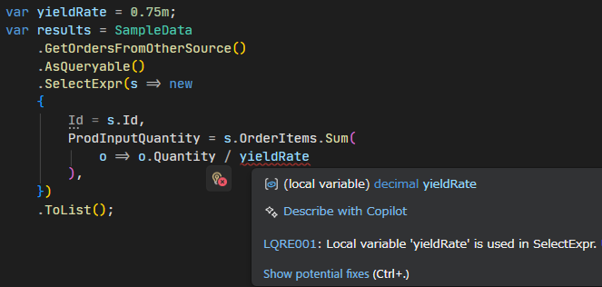

<div align="center">
  

  # Linqraft

  [](https://www.nuget.org/packages/Linqraft/)  [![DeepWiki](https://img.shields.io/badge/DeepWiki-Linqraft-blue.svg?logo=)](https://deepwiki.com/arika0093/Linqraft)

  *Write projections easily with **on-demand DTO** generation*.
</div>

## Features
*Linqraft* is a Roslyn Source Generator for easily writing `IQueryable` projections.

### Query-based automatic DTO generation

You can write projections with `UseLinqraft().Select<TDto>(...)` and get DTOs generated automatically based on the shape of your selector expression.
This allows for *"what you see is what you get"* declarations, unifying DTO definition and query writing.
Complex queries are fully supported, including nested DTOs, collections, and calculated fields.

For example, the following declaration will automatically generate `OrderDto` and `OrderItemDto`:

```csharp
// orders: List<OrderDto✨️>
var orders = await dbContext.Orders
    .UseLinqraft()
    .Select<OrderDto>(o => new {
        // CustomerName: string
        CustomerName = o.Customer.Name,
        // Items: IEnumerable<OrderItemDto✨️>
        Items = o.OrderItems.Select(oi => new {
            ProductName = oi.Product.Name,
            Quantity = oi.Quantity,
            // calculated field are supported !
            Price = oi.UnitPrice * oi.Quantity,
        }),
    })
    .ToListAsync();
```

<details>
<summary>Generated DTOs Sample</summary>

```csharp
namespace YourNamespace
{
    public partial class OrderDto
    {
        public string CustomerName { get; set; }
        public IEnumerable<LinqraftGenerated_Hash1234.OrderItemDto> Items { get; set; }
    }
}

namespace YourNamespace.LinqraftGenerated_Hash1234
{
    [EditorBrowsable(EditorBrowsableState.Never)]
    [LinqraftAutoGeneratedDtoAttribute]
    public partial class OrderItemDto
    {
        public string ProductName { get; set; }
        public int Quantity { get; set; }
        public decimal Price { get; set; }
    }
}
```

</details>

### Null-propagation operator support

C# Expression Trees do not support the null-propagation operator (`?.`).
Linqraft generates queries through anonymous type generation, allowing you to write queries using the null-propagation operator.

```csharp
var orders = await dbContext.Orders
    .UseLinqraft()
    .Select<OrderDto>(o => new {
        // CustomerName: string?
        CustomerName = o.Customer?.Name,
        // Items: IEnumerable<string>
        ProductNames = o.OrderItems.Select(oi => oi.Product?.Name),
        // > If all OrderItems.Products are null, the array will be empty.
    })
    .ToListAsync();
```

### Drop-in Replacement Analyzers

[Analyzers](./docs/analyzers/README.md) are provided to replace existing Select code with Linqraft. The replacement is completed in an instant.

```csharp
// before
// order is (anonymous type)
var order = await dbContext.Orders
    .Select(o => new {
        CustomerName = o.Customer != null ? o.Customer.Name : null,
        Items = o.OrderItems.Select(oi => new {
            ProductName = oi.Product != null ? oi.Product.Name : null,
        }),
    })
    .FirstOrDefaultAsync();

// after (apply code fix)
// order is OrderDto✨️
var order = await dbContext.Orders
    .UseLinqraft().Select<OrderDto>(o => new {
        // automatically replace null checks with null-propagation operator
        CustomerName = o.Customer?.Name,
        Items = o.OrderItems.Select(oi => new {
            ProductName = oi.Product?.Name,
        }),
    })
    .FirstOrDefaultAsync();
```

<details>
<summary>Animation of the code replacement process</summary>


</details>

### Projection Helpers for simplify

Linqraft also supports explicit projection helpers for cases where you want the generator to rewrite part of a selector body:

```csharp
var rows = dbContext.Orders
    .UseLinqraft()
    // add 2nd argument to Select, which is a helper object
    // that provides methods for rewriting parts of the selector body.
    .Select<OrderRow>((o, helper) => new
    {
        CustomerName = helper.AsLeftJoin(o.Customer).Name,
        RequiredCustomerName = helper.AsInnerJoin(o.Customer).Name,
        Customer = helper.AsProjection<CustomerDto>(o.Customer),
        CustomerSummary = helper.Project(o.Customer).Select(customer => new
        {
            customer.Id,
            customer.Name,
        }),
        FirstLargeItem = helper.AsInline(o.FirstLargeItemProductName),
    });
```

More details about projection helpers are available in the [Projection Helpers](#projection-helpers) section below.


### No Dependencies 

Thanks to the magic of Source Generators and Interceptors, there are no dependencies in production. The generated code consists of simple LINQ queries that work with any LINQ provider, such as EF Core or Dapper.

<details>
<summary>What kind of code is generated?</summary>

The generated code looks like this:

```csharp
namespace Linqraft
{
    file static partial class SelectExprInterceptExtensions
    {
        [global::System.Runtime.CompilerServices.InterceptsLocationAttribute(1, "qfSAs0Q48gqm9UOXhtgXLG0BAABUdXRvcmlhbENhc2VUZXN0LmNz")]
        public static global::System.Linq.IQueryable<TResult> Select_0A972FCF98437ABE<TIn, TResult>(this global::Linqraft.LinqraftQuery<TIn> query, global::System.Func<TIn, object> selector) where TIn : class
        {
            var converted = ((global::System.Linq.IQueryable<global::Tutorial.Order>)(object)query.GetSource()).Select(o => new global::Tutorial.OrderDto() {
                Id = o.Id,
                CustomerName = o.Customer != null ? (global::System.String?)(o.Customer.Name) : null,
                CustomerCountry = o.Customer != null && o.Customer.Address != null && o.Customer.Address.Country != null ? (global::System.String?)(o.Customer.Address.Country.Name) : null,
                CustomerCity = o.Customer != null && o.Customer.Address != null && o.Customer.Address.City != null ? (global::System.String?)(o.Customer.Address.City.Name) : null,
                CustomerInfo = new global::Tutorial.LinqraftGenerated_2B64B4DD.CustomerInfoDto {
                    Email = o.Customer != null ? (global::System.String?)(o.Customer.EmailAddress) : null,
                    Phone = o.Customer != null ? (global::System.String?)(o.Customer.PhoneNumber) : null,
                },
                LatestOrderDate = global::System.Linq.Enumerable.Max(
                    o.OrderItems,
                    oi => oi.OrderDate
                ),
                TotalAmount = global::System.Linq.Enumerable.Sum(
                    o.OrderItems,
                    oi => oi.Quantity * oi.UnitPrice
                ),
                Items = global::System.Linq.Enumerable.Select(
                    o.OrderItems,
                    oi => new global::Tutorial.LinqraftGenerated_67EDED21.ItemsDto {
                        ProductName = oi.Product != null ? (global::System.String?)(oi.Product.Name) : null,
                        Quantity = oi.Quantity,
                    }
                ),
            });
            return (global::System.Linq.IQueryable<TResult>)(object)converted;
        }
    }
}
```

It may look complex, but what it does is very simple.

* All type names are written in fully qualified names.
* Calls like `a.Select(x).Where(y)...` are transformed into forms like `Enumerable.Where(Enumerable.Select(a, x), y)`.
* Null-propagation operators are transformed into ternary operators.
* If a DTO class is explicitly specified, an instance of that class is generated.
* Nested DTOs are generated in a `LinqraftGenerated_{Hash}` namespace, which is a measure to avoid collisions between auto-generated classes.

</details>

## Installation

Linqraft is available on [NuGet](https://www.nuget.org/packages/Linqraft/). Install it with the following command:

```
dotnet add package Linqraft
```

Linqraft requires **C# 12.0 or later**. On **.NET 8 and later**, it works out of the box.  

<details>
<summary>Additional steps are required when targeting `.NET 7` or below</summary>

```xml
<!-- .NET 7 or below -->
<Project>
  <PropertyGroup>
    <!-- Set LangVersion to 12.0 or later -->
    <LangVersion>12.0</LangVersion>
  </PropertyGroup>
  <ItemGroup>
    <!-- Use Polysharp or Polyfill to get C# 12 features on older runtimes -->
    <PackageReference Include="Polysharp" Version="1.*" />
  </ItemGroup>
</Project>
```

Use [PolySharp](https://github.com/Sergio0694/PolySharp/) or [Polyfill](https://github.com/SimonCropp/Polyfill) so the required C# features are available even when targeting older runtimes.

</details>

### AI Agent Integration (APM)

Linqraft ships an [APM](https://github.com/microsoft/apm) skill so AI coding agents can discover and use the library automatically. Install it with:

```bash
# use APM (installs only the skills/ package files via sparse checkout)
apm install arika0093/Linqraft/skills
# or install manually
curl https://raw.githubusercontent.com/arika0093/Linqraft/main/skills/linqraft/SKILL.md -o your/skills/linqraft/SKILL.md
```

Since Linqraft's DTO generation is an unfamiliar pattern for AI, installing the skill is recommended.

## Basic Usage
Linqraft supports anonymous projections, auto-generated DTOs, pre-existing DTOs, grouped and flattened projections, and runtime DTO generation through `LinqraftKit.Generate`. 

### Explicit DTO Pattern

Use `UseLinqraft().Select<TDto>(...)` when you want Linqraft to generate a named DTO from the selector body.

```csharp
var orders = await dbContext.Orders
    .UseLinqraft().Select<OrderDto>(o => new
    {
        o.Id,
        CustomerName = o.Customer?.Name,
        CustomerCountry = o.Customer?.Address?.Country?.Name,
        Items = o.OrderItems.Select(oi => new
        {
            ProductName = oi.Product?.Name,
            oi.Quantity,
        }),
    })
    .ToListAsync();
```

Linqraft generates a partial `OrderDto` and any required nested DTOs automatically.

```csharp
public partial class OrderDto
{
    public required int Id { get; set; }
    public required string? CustomerName { get; set; }
    public required string? CustomerCountry { get; set; }
    public required IEnumerable<ItemsDto> Items { get; set; }
}

namespace LinqraftGenerated_HASH
{
    public partial class ItemsDto
    {
        public required string? ProductName { get; set; }
        public required int Quantity { get; set; }
    }
}
```

The same pattern also works for in-memory `IEnumerable<T>` pipelines:

```csharp
var orders = myList
    .UseLinqraft().Select<OrderDto>(o => new
    {
        o.Id,
        CustomerName = o.Customer?.Name,
    })
    .ToList();
```

### Anonymous Pattern

Use `UseLinqraft().Select(...)` without generic type parameters when you only need a one-off result shape.

```csharp
var orders = await dbContext.Orders
    .UseLinqraft().Select(o => new
    {
        o.Id,
        CustomerName = o.Customer?.Name,
        TotalAmount = o.OrderItems.Sum(oi => oi.Quantity * oi.UnitPrice),
    })
    .ToListAsync();
```

This is ideal for quick exploration, ad-hoc queries, and prototypes.

> [!NOTE]
> This is mostly the same as a normal `Select(new => { ... })`, but with support for features like the null-propagation operator.

### Pre-existing DTO Pattern

Use `UseLinqraft().Select(...)` with your own DTO class when the type already exists or must carry custom attributes and interfaces.

```csharp
public class OrderDto
{
    [JsonPropertyName("order_id")]
    public int Id { get; set; }

    [Required]
    public string CustomerName { get; set; } = "";

    public decimal TotalAmount { get; set; }
}

var orders = await dbContext.Orders
    .UseLinqraft()
    .Select(o => new OrderDto
    {
        Id = o.Id,
        CustomerName = o.Customer?.Name ?? string.Empty,
        TotalAmount = o.OrderItems.Sum(oi => oi.Quantity * oi.UnitPrice),
    })
    .ToListAsync();
```

This keeps Linqraft's null-propagation support while leaving the DTO definition fully under your control.

### Aggregation and Flattening Helpers

In addition to `Select`, the following two projection patterns are also available (same as normal LINQ):

* `SelectMany`: flattening projections over nested collections
* `GroupBy`: projections over groupings

Use `GroupBy<TKey, TResult>(...)` when the final result is a projection over an `IGrouping<TKey, TSource>`:

```csharp
var result = dbContext.HealthChecks
    .UseLinqraft()
    .GroupBy<string, HealthSummaryDto>(
        check => check.Region,
        group => new
        {
            Region = group.Key,
            AllHealthy = group.All(x => x.Status == "Healthy"),
            Checks = group.Select(x => new
            {
                x.Id,
                x.Status,
            }),
        })
    .ToListAsync();
```

Use `SelectMany<TResult>(...)` when you want the final result to be flattened:

```csharp
var rows = dbContext.Orders
    .UseLinqraft()
    .SelectMany<OrderItemRow>(order =>
        order.Items.Select(item => new
        {
            OrderId = order.Id,
            item.ProductName,
            item.Quantity,
        }))
    .ToListAsync();
```

### LinqraftKit.Generate

Use `LinqraftKit.Generate<TDto>(...)` when you want Linqraft to generate a DTO from a runtime object instead of from an `IEnumerable` or `IQueryable` projection.

```csharp
var id = 42;
var dto = LinqraftKit.Generate<OrderBundleDto>(
    new {
        Id = id,
        Customer = new { Name = "Ada" },
        ItemNames = new[] { "Keyboard", "Mouse" },
    },
    capture: () => id
);
```

This works well for combining runtime values, nested anonymous objects, arrays, lists, and values produced by other Linqraft projections.

## Usage Documentation
### Local Variable Capture

Pass the required local variables to `capture:` via a delegate (`Func<object>`) that returns either a single value or an anonymous object/tuple for multiple values, like this:

```csharp
var threshold = 100;
var multiplier = 2;
var suffix = " units";

var converted = dbContext.Entities
    .UseLinqraft()
    .Select<EntityDto>(
        x => new
        {
            x.Id,
            IsExpensive = x.Price > threshold,
            DoubledValue = x.Value * multiplier,
            Description = x.Name + suffix,
        },
        capture: () => (threshold, multiplier, suffix)
    );
```

Linqraft analyzers can detect missing capture values and can rewrite legacy anonymous-object captures to the delegate form automatically.



### Array Nullability Removal

Linqraft can automatically remove nullability from generated collection properties when an empty collection is a better semantic result than `null`.
This avoids repetitive post-processing such as `dto.Items ?? []`.

```csharp
var dto = query
    .UseLinqraft()
    .Select<EntityDto>(e => new
    {
        // ChildNames: List<string>
        ChildNames = e.Child?.Select(c => c.Name).ToList(),
        // ChildDtos: IEnumerable<ChildDto>
        ChildDtos = e.Child?.Select(c => new { c.Name, c.Description }),
    });

```

<details>
<summary>Show array nullability details</summary>

#### Why it exists

In practice, collection-like members usually behave better as empty collections than as nullable collections. When Linqraft can prove that shape safely, it removes `?` from the generated property type and emits empty collections for the null branch.

#### Rules

Nullability is removed when **all** of the following are true:

1. The expression does not contain a ternary operator (`? :`)
2. The type is `IEnumerable<T>` or a derived collection type
3. The expression uses null-conditional access (`?.`)
4. The expression contains a `Select` or `SelectMany` call

#### Example

```csharp
var dto = query
    .UseLinqraft()
    .Select<EntityDto>(e => new
    {
        ChildNames = e.Child?.Select(c => c.Name).ToList(),
        ChildDtos = e.Child?.Select(c => new { c.Name, c.Description }),
        ExplicitNullableNames = e.Child != null
            ? e.Child.Select(c => c.Name).ToList()
            : null,
    });
```

That produces collection properties like:

```csharp
public partial class EntityDto
{
    public required List<string> ChildNames { get; set; }
    public required IEnumerable<ChildDto> ChildDtos { get; set; }
    public required List<string>? ExplicitNullableNames { get; set; }
}
```

and generated fallbacks like:

```csharp
ChildNames = d.Child != null
    ? d.Child.Select(c => c.Name).ToList()
    : new List<string>(),

ChildDtos = d.Child != null
    ? d.Child.Select(c => new ChildDto { Name = c.Name, Description = c.Description })
    : Enumerable.Empty<ChildDto>(),
```

#### Disable the behavior
If you want to disable this behavior, you can set the MSBuild property `LinqraftArrayNullabilityRemoval` to `false`.

```xml
<PropertyGroup>
  <LinqraftArrayNullabilityRemoval>false</LinqraftArrayNullabilityRemoval>
</PropertyGroup>
```

</details>

### Partial Classes

All generated DTOs are `partial`, so you can extend them with methods, interfaces, attributes, or predeclared properties whose accessibility you control yourself.

```csharp
// can add methods, interfaces, attributes, etc.
[DebuggerDisplay("{GetDisplayName()}")]
public partial class OrderDto : ISampleInterface
{
    public string GetDisplayName() => $"Order #{Id} - {CustomerName}";
    public bool IsLargeOrder => TotalAmount > 1000;
}

var order = await dbContext.Orders
    .UseLinqraft()
    .Select<OrderDto>(o => new
    {
        o.Id,
        CustomerName = o.Customer?.Name,
        TotalAmount = o.OrderItems.Sum(oi => oi.Quantity * oi.UnitPrice),
    })
    .FirstOrDefaultAsync();
// you can call the method you added to the partial class
if (order is not null)
{
    Console.WriteLine($"{order.GetDisplayName()} is {(order.IsLargeOrder ? "large" : "small")}.");
}
```

### Mapping Methods

Linqraft normally generates projection code inline through interceptors, but sometimes you want a reusable extension method that can be called from multiple places or embedded inside EF Core compiled queries through `EF.CompileAsyncQuery`. In that case, you can write a template method and let Linqraft generate the full mapping method based on it.

For example, you can write a template like this:

```csharp
// your declaration
public static partial class OrderQueries
{
    [LinqraftMapping]
    internal static IQueryable<OrderDto> ProjectToOrderDto(this LinqraftMapper<Order> source) =>
        source.Select<OrderDto>(o => new
        {
            o.Id,
            CustomerName = o.Customer?.Name,
            Items = o.Items.Select(i => new
            {
                i.ProductName,
                i.Quantity,
            }),
        });
}

// generated code such as:
public static partial class OrderQueries
{
    internal static IQueryable<OrderDto> ProjectToOrderDto(this IQueryable<Order> source) =>
        source.Select<OrderDto>(o => new OrderDto { /* ... */ });

    internal static IEnumerable<OrderDto> ProjectToOrderDto(this IEnumerable<Order> source) =>
        source.Select<OrderDto>(o => new OrderDto { /* ... */ });
}

// and you can call it like this:
var orders = await dbContext.Orders
    .ProjectToOrderDto()
    .ToListAsync();
```

This is useful in cases such as:

* Reusable projections shared across multiple callers
* EF Core compiled queries through `EF.CompileAsyncQuery`
* EF Core precompiled queries on newer runtimes
* Dedicated query classes for complex projections


### Projection Helpers

Projection helpers are exposed through the selector's `IProjectionHelper` parameter.
They let you ask Linqraft to rewrite a specific fragment inside the generated projection instead of treating the selector body as a plain expression tree.

<details>
<summary>List of projection helpers</summary>

#### `helper.AsLeftJoin(value)`

Use `helper.AsLeftJoin(value)` when you want nullable navigation access to be emitted as an explicit left-join-style null guard:

```csharp
var result = dbContext.Orders
    .UseLinqraft()
    .Select<OrderRowDto>((order, helper) => new
    {
        CustomerName = helper.AsLeftJoin(order.Customer).Name,
    })
    .ToListAsync();
```

This produces generated code shaped like `order.Customer != null ? order.Customer.Name : null`.

#### `helper.AsInnerJoin(value)`

Use `helper.AsInnerJoin(value)` when rows with a null navigation should be filtered out before projection:

```csharp
var result = dbContext.Orders
    .UseLinqraft()
    .Select<OrderRowDto>((order, helper) => new
    {
        CustomerName = helper.AsInnerJoin(order.Customer).Name,
    })
    .ToListAsync();
```

#### `helper.AsInline(value)`

Use `helper.AsInline(value)` when a selector references a computed instance property or method that should be inlined into the generated projection:

```csharp
public sealed class Order
{
    public List<OrderItem> Items { get; set; } = [];

    public string? FirstLargeItemProductName => this
        .Items.Where(item => item.Quantity >= 2)
        .OrderBy(item => item.Id)
        .Select(item => item.ProductName)
        .FirstOrDefault();
}

var result = dbContext.Orders
    .UseLinqraft()
    .Select<OrderRowDto>((order, helper) => new
    {
        FirstLargeItemProductName = helper.AsInline(order.FirstLargeItemProductName),
    })
    .ToListAsync();
```

Recursive `AsInline` expansion is rejected to avoid infinite rewriting loops.

#### `helper.AsProjection<TDto>(value)`

Use `helper.AsProjection<TDto>(value)` when you want a nested member to become an explicit DTO instead of exposing the original entity or complex type:

```csharp
var result = dbContext.Orders
    .UseLinqraft()
    .Select<OrderRowDto>((order, helper) => new
    {
        order.Id,
        Customer = helper.AsProjection<CustomerSummaryDto>(order.Customer),
    })
    .ToListAsync();
```

If you omit the generic argument, Linqraft uses `[SourceTypeName]Dto`. `AsProjection` currently copies scalar, enum, string, and value-type members; navigation and collection members are not expanded automatically.

#### `helper.Project<T>(value).Select(...)`

Use `Project(...).Select(...)` when you want to shape a nested projection without repeating the full member path:

```csharp
var result = dbContext.Orders
    .UseLinqraft()
    .Select<OrderRowDto>((order, helper) => new
    {
        order.Id,
        Customer = helper
            .Project<Customer>(order.Customer)
            .Select(customer => new { customer.Id, customer.Name }),
    })
    .ToListAsync();
```

If you omit `T`, Linqraft uses the destination member name to derive the generated DTO name.


</details>

### Analyzers

Linqraft ships analyzers and code fixes that can migrate ordinary `Select` calls to `UseLinqraft().Select(...)`, add missing captures, simplify null checks, and highlight projection-specific issues.

See [Analyzers](./docs/analyzers/README.md) for the full rule list and code-fix catalog.

## Advanced Features

<details>
<summary>
Syntax variations: <code>UseLinqraft().Select&lt;TDto&gt;</code> vs. <code>SelectExpr&lt;TSource, TDto&gt;</code>
</summary>

Linqraft supports the following two syntax variations:

```csharp
// UseLinqraft().Select<TDto>(...) syntax
var result1 = query
    .UseLinqraft()
    .Select<OrderDto>(o => new
    {
        o.Id,
        CustomerName = o.Customer?.Name,
    })
    .ToList();

// SelectExpr<TSource, TDto>(...) syntax
var result2 = query
    .SelectExpr<Order, OrderDto>(o => new
    {
        o.Id,
        CustomerName = o.Customer?.Name,
    })
    .ToList();
```

The two variations have their own advantages:

* `UseLinqraft().Select<TDto>(...)`
  * Available since v0.10
  * Makes it clear that Linqraft is being used.
  * Does not require specifying `TSource`, only the DTO type parameter you need.
* `SelectExpr<TSource, TDto>(...)`
  * More concise.
  * Slightly more performant since it doesn't generate the extra `LinqraftQuery<TSource>` object.

Both variations produce the same generated code and have the same capabilities, so you can choose the one that best fits your style and needs.

</details>

<details>
<summary>Nested Explicit DTO Reuse</summary>

When nested DTOs need stable names and reuse across multiple queries,
Linqraft provides a beta pattern based on nested `UseLinqraft().Select<TDto>(...)` calls.

```csharp
var result = query
    .UseLinqraft().Select<OrderDto>(o => new
    {
        o.Id,
        Items = o.OrderItems.UseLinqraft().Select<OrderItemDto>(i => new
        {
            i.ProductName,
        }),
    });

// You must declare the DTOs as partial for this to work.
internal partial class OrderDto;
internal partial class OrderItemDto;
```

</details>

<details>
<summary>Linqraft global properties</summary>

#### Available MSBuild properties

| Property | Default | Purpose |
|---|---|---|
| `LinqraftGlobalNamespace` | empty | Override the namespace used when the source type is in the global namespace |
| `LinqraftRecordGenerate` | `false` | Generate `record` instead of `class` |
| `LinqraftPropertyAccessor` | `Default` | Choose `get; set;`, `get; init;`, or `get; internal set;` |
| `LinqraftHasRequired` | `true` | Control whether generated properties use `required` |
| `LinqraftCommentOutput` | `All` | Emit copied comments as full summary+remarks, summary-only, or none |
| `LinqraftArrayNullabilityRemoval` | `true` | Remove nullability from eligible collection properties |
| `LinqraftNestedDtoUseHashNamespace` | `true` | Choose hash namespace vs. hash class names for nested DTOs |
| `LinqraftGlobalUsing` | `true` | Emit `global using Linqraft;` for compatibility with earlier versions |

A typical `.csproj` section looks like this:

```xml
<Project>
  <PropertyGroup>
    <LinqraftGlobalNamespace></LinqraftGlobalNamespace>
    <LinqraftRecordGenerate>false</LinqraftRecordGenerate>
    <LinqraftPropertyAccessor>Default</LinqraftPropertyAccessor>
    <LinqraftHasRequired>true</LinqraftHasRequired>
    <LinqraftCommentOutput>All</LinqraftCommentOutput>
    <LinqraftArrayNullabilityRemoval>true</LinqraftArrayNullabilityRemoval>
    <LinqraftNestedDtoUseHashNamespace>true</LinqraftNestedDtoUseHashNamespace>
    <LinqraftGlobalUsing>true</LinqraftGlobalUsing>
  </PropertyGroup>
</Project>
```

#### DTO shape and accessors

`LinqraftRecordGenerate`, `LinqraftPropertyAccessor`, and `LinqraftHasRequired` control how generated DTO types look:

```xml
<LinqraftRecordGenerate>true</LinqraftRecordGenerate>
<LinqraftPropertyAccessor>GetAndInit</LinqraftPropertyAccessor>
<LinqraftHasRequired>false</LinqraftHasRequired>
```

#### Generated Documentation

Linqraft can copy comments from the source type and members into the generated DTOs.
Use `LinqraftCommentOutput` to control how much of the original comments are copied:

```xml
<PropertyGroup>
  <LinqraftCommentOutput>All</LinqraftCommentOutput>
  <LinqraftCommentOutput>SummaryOnly</LinqraftCommentOutput>
  <LinqraftCommentOutput>None</LinqraftCommentOutput>
</PropertyGroup>
```

</details>

## FAQ
### How is the performance?
Linqraft's performance is designed to be on par with hand-written DTO code because it generates the same code you would write manually.

Don't believe it? Check out the [Benchmark](./examples/Linqraft.Benchmark).

### Does Linqraft only work with Entity Framework?

No. Linqraft works with any LINQ provider that supports `IEnumerable<T>` and/or `IQueryable<T>`.

```csharp
// Entity Framework Core
var efOrders = await dbContext.Orders
    .UseLinqraft()
    .Select<OrderDto>(o => new { o.Id, o.CustomerName })
    .ToListAsync();

// In-memory collection
var inMemoryOrders = myList
    .UseLinqraft()
    .Select<OrderDto>(o => new { o.Id, o.CustomerName })
    .ToList();

// LINQ to Objects
var filtered = items
    .Where(x => x.IsActive)
    .UseLinqraft()
    .Select<ItemDto>(x => new { x.Id, x.Name })
    .ToArray();
```

### Can generated DTOs be used elsewhere?

Yes. Generated DTOs are regular C# classes, so they work as API response models, method return types, parameters, variables, serializer targets, and test fixtures.

```csharp
[HttpGet]
public async Task<ActionResult<List<OrderDto>>> GetOrders()
{
    var orders = await dbContext.Orders
        .UseLinqraft()
        .Select<OrderDto>(o => new { o.Id, o.CustomerName })
        .ToListAsync();

    return Ok(orders);
}
```

### Can I inspect the generated code?

Yes. Use **F12 / Go to Definition** on a generated DTO name, or emit the generated files to disk:

```xml
<Project>
  <PropertyGroup>
    <EmitCompilerGeneratedFiles>true</EmitCompilerGeneratedFiles>
    <CompilerGeneratedFilesOutputPath>Generated</CompilerGeneratedFilesOutputPath>
  </PropertyGroup>
</Project>
```

## License

```
Copyright 2025-2026 arika0093

Licensed under the Apache License, Version 2.0 (the "License");
you may not use this file except in compliance with the License.
You may obtain a copy of the License at

http://www.apache.org/licenses/LICENSE-2.0
```
