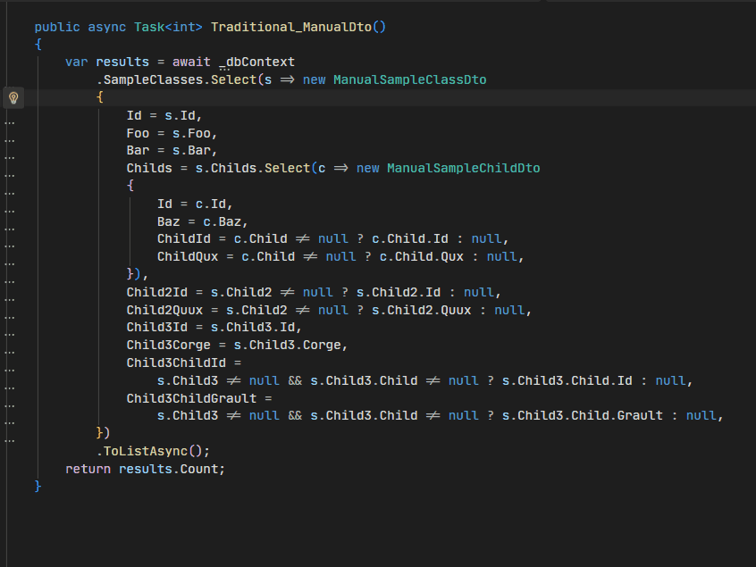

<div align="center">
  

  # Linqraft

  [](https://www.nuget.org/packages/Linqraft/)  [![DeepWiki](https://img.shields.io/badge/DeepWiki-Linqraft-blue.svg?logo=)](https://deepwiki.com/arika0093/Linqraft)

  *Write projections easily with **on-demand DTO** generation*.
</div>

## Features
*Linqraft* is a Roslyn Source Generator for easily writing `IQueryable` projections.

### Query-based automatic DTO generation

You can write projections with `SelectExpr` and get DTOs generated automatically based on the shape of your selector expression.
This allows for *"what you see is what you get"* declarations, unifying DTO definition and query writing.
Complex queries are fully supported, including nested DTOs, collections, and calculated fields.

For example, the following declaration will automatically generate `OrderDto` and `OrderItemDto`:

```csharp
// orders: List<OrderDto✨️>
var orders = await dbContext.Orders
    .SelectExpr<Order, OrderDto>(o => new {
        // CustomerName: string
        CustomerName = o.Customer.Name,
        // Items: IEnumerable<OrderItemDto✨️>
        Items = o.OrderItems.Select(oi => new {
            ProductName = oi.Product.Name,
            Quantity = oi.Quantity,
            // calculated field are supported !
            Price = oi.UnitPrice * oi.Quantity,
        }),
    })
    .ToListAsync();
```

<details>
<summary>Generated DTOs Sample</summary>

```csharp
namespace YourNamespace
{
    public partial class OrderDto
    {
        public string CustomerName { get; set; }
        public IEnumerable<LinqraftGenerated_Hash1234.OrderItemDto> Items { get; set; }
    }
}

namespace YourNamespace.LinqraftGenerated_Hash1234
{
    [EditorBrowsable(EditorBrowsableState.Never)]
    [LinqraftAutoGeneratedDtoAttribute]
    public partial class OrderItemDto
    {
        public string ProductName { get; set; }
        public int Quantity { get; set; }
        public decimal Price { get; set; }
    }
}
```

</details>

### Null-propagation operator support

C# Expression Trees do not support the null-propagation operator (`?.`).
Linqraft generates queries through anonymous type generation, allowing you to write queries using the null-propagation operator.

```csharp
var orders = await dbContext.Orders
    .SelectExpr<Order, OrderDto>(o => new {
        // CustomerName: string?
        CustomerName = o.Customer?.Name,
        // Items: IEnumerable<string>
        ProductNames = o.OrderItems.Select(oi => oi.Product?.Name),
        // > If all OrderItems.Products are null, the array will be empty.
    })
    .ToListAsync();
```

### Drop-in Replacement Analyzers

[Analyzers](./docs/analyzers/README.md) are provided to replace existing Select code with Linqraft. The replacement is completed in an instant.

```csharp
// before
// order is (anonymous type)
var order = await dbContext.Orders
    .Select(o => new {
        CustomerName = o.Customer != null ? o.Customer.Name : null,
        Items = o.OrderItems.Select(oi => new {
            ProductName = oi.Product != null ? oi.Product.Name : null,
        }),
    })
    .FirstOrDefaultAsync();

// after (apply code fix)
// order is OrderDto✨️
var order = await dbContext.Orders
    .SelectExpr<Order, OrderDto>(o => new {
        // automatically replace null checks with null-propagation operator
        CustomerName = o.Customer?.Name,
        Items = o.OrderItems.Select(oi => new {
            ProductName = oi.Product?.Name,
        }),
    })
    .FirstOrDefaultAsync();
```

<details>
<summary>Animation of the code replacement process</summary>



</details>

### Projection Helpers

Linqraft also supports explicit projection helpers for cases where you want the generator to rewrite part of a selector body:

```csharp
var rows = dbContext.Orders
    // add 2nd argument to SelectExpr,
    // which is a helper object that provides methods for rewriting parts of the selector body.
    .SelectExpr((o, helper) => new
    {
        CustomerName = helper.AsLeftJoin(o.Customer).Name,
        FirstLargeItem = helper.AsProjectable(o.FirstLargeItemProductName),
    });
```

Currently, the following helpers are available:

* `AsLeftJoin(query)`
  * It generates queries that behave like a `LEFT JOIN`.
* `AsProjectable(query)`
  * It realizes the behavior like [EntityFrameworkCore.Projectables](https://github.com/EFNext/EntityFrameworkCore.Projectables).
  * That is, the query logic inside properties like `FirstLargeItemProductName` will be expanded as if it were written inline inside the SelectExpr.

### No Dependencies 

Thanks to the magic of Source Generators and Interceptors, there are no dependencies in production. The generated code consists of simple LINQ queries that work with any LINQ provider, such as EF Core or Dapper.

<details>
<summary>What kind of code is generated?</summary>

The generated code looks like this:

```csharp
namespace Linqraft
{
    file static partial class SelectExprInterceptExtensions
    {
        [global::System.Runtime.CompilerServices.InterceptsLocationAttribute(1, "zoTX6YMzp8cIf98imvJzs8YBAABUdXRvcmlhbENhc2VUZXN0LmNz")]
        public static global::System.Linq.IQueryable<TResult> SelectExpr_55AF867EC668046B<TIn, TResult>(this global::System.Linq.IQueryable<TIn> query, global::System.Func<TIn, object> selector) where TIn : class
        {
            var converted = ((global::System.Linq.IQueryable<global::Tutorial.Order>)(object)query).Select(o => new global::Tutorial.OrderDto() {
                Id = o.Id,
                CustomerName = o.Customer != null ? (global::System.String?)(o.Customer.Name) : null,
                CustomerCountry = o.Customer != null && o.Customer.Address != null && o.Customer.Address.Country != null ? (global::System.String?)(o.Customer.Address.Country.Name) : null,
                CustomerCity = o.Customer != null && o.Customer.Address != null && o.Customer.Address.City != null ? (global::System.String?)(o.Customer.Address.City.Name) : null,
                CustomerInfo = new global::Tutorial.LinqraftGenerated_2B64B4DD.CustomerInfoDto {
                    Email = o.Customer != null ? (global::System.String?)(o.Customer.EmailAddress) : null,
                    Phone = o.Customer != null ? (global::System.String?)(o.Customer.PhoneNumber) : null,
                },
                LatestOrderDate = global::System.Linq.Enumerable.Max(
                    o.OrderItems,
                    oi => oi.OrderDate
                ),
                TotalAmount = global::System.Linq.Enumerable.Sum(
                    o.OrderItems,
                    oi => oi.Quantity * oi.UnitPrice
                ),
                Items = global::System.Linq.Enumerable.Select(
                    o.OrderItems,
                    oi => new global::Tutorial.LinqraftGenerated_67EDED21.ItemsDto {
                        ProductName = oi.Product != null ? (global::System.String?)(oi.Product.Name) : null,
                        Quantity = oi.Quantity,
                    }
                ),
            });
            return (global::System.Linq.IQueryable<TResult>)(object)converted;
        }
    }
}
```

It may look complex, but what it does is very simple.

* All type names are written in fully qualified names.
* Calls like `a.Select(x).Where(y)...` are transformed into forms like `Enumerable.Where(Enumerable.Select(a, x), y)`.
* Null-propagation operators are transformed into ternary operators.
* If a DTO class is explicitly specified, an instance of that class is generated.
* Nested DTOs are generated in a `LinqraftGenerated_{Hash}` namespace, which is a measure to avoid collisions between auto-generated classes.

</details>

## Installation

Install `Linqraft` from NuGet:

```bash
dotnet add package Linqraft
```

> [!NOTE]
> Linqraft works out of the box with **.NET 8 and later**. For .NET 7(C# 11) and below, additional setup is required.  
> see [Installation Guide](./docs/library/installation.md#net-7-and-below) for details.

## Basic Usage
### Explicit DTO pattern

The most basic usage pattern, with automatic DTO generation.

```csharp
// orders: List<OrderDto✨️>
var orders = await dbContext.Orders
    // By explicitly specifying the generic arguments,
    // you can specify the type of the DTO.
    .SelectExpr<Order, OrderDto>(o => new
    {
        Id = o.Id,
        CustomerName = o.Customer?.Name,
        // ...
    })
    .ToListAsync();
```


### Anonymous pattern

Use `SelectExpr` without generics to get an anonymous-type projection.

```csharp
// orders: List<{anonymous type}>
var orders = await dbContext.Orders
    // without generic arguments, the DTO type will be an anonymous type 
    // generated based on the selector body.
    .SelectExpr(o => new
    {
        Id = o.Id,
        // you can also use null-propagation operator
        // without worrying about Expression Tree limitations.
        CustomerName = o.Customer?.Name,
    })
    .ToListAsync();
```

### Pre-existing DTO pattern

Use your existing DTO classes:

```csharp
// orders: List<MyOrderDto>
var orders = await dbContext.Orders
    .SelectExpr(o => new MyOrderDto
    {
        Id = o.Id,
        // of course, null-propagation operator is supported as well.
        CustomerName = o.Customer?.Name,
    })
    .ToListAsync();

// your existing DTO class
public class MyOrderDto { /* ... */ }
```

For more usage patterns and examples, see the [Usage Patterns Guide](./docs/library/usage-patterns.md).

## Documentation

### Getting Started

* **[Installation](./docs/library/installation.md)** - Prerequisites, installation, and setup
* **[Usage Patterns](./docs/library/usage-patterns.md)** - Anonymous, Explicit DTO, and Pre-existing DTO patterns

### Usage Guides

* **[Local Variable Capture](./docs/library/local-variable-capture.md)** - Using local variables in SelectExpr
* **[Array Nullability Removal](./docs/library/array-nullability.md)** - Automatic null handling for collections
* **[Partial Classes](./docs/library/partial-classes.md)** - Extending generated DTOs
* **[Nested DTO Naming](./docs/library/nested-dto-naming.md)** - Customizing nested DTO names
* **[Mapping Methods](./docs/library/mapping-methods.md)** - Generating mapping methods to class instead of interceptors
* **[Projection Hooks](./docs/library/projection-hooks.md)** - Customizing projection behavior with hooks
* **[Nested SelectExpr](./docs/library/nested-selectexpr.md) (beta)** - Using nested SelectExpr for reusable DTOs
* **[Auto-Generated Comments](./docs/library/auto-generated-comments.md)** - XML documentation generation
* **[Global Properties](./docs/library/global-properties.md)** - MSBuild configuration options

### Performance & Comparison

* **[Performance](./docs/library/performance.md)** - Benchmarks
* **[Library Comparison](./docs/library/library-comparison.md)** - Comparisons with AutoMapper, Mapster, Mapperly, and Facet

### Help

* **[FAQ](./docs/library/faq.md)** - Common questions
* **[Analyzers](./docs/analyzers/README.md)** - Code analyzers and fixes

## Examples

Example projects are available in the [examples](./examples) folder:

* [Linqraft.Sample](./examples/Linqraft.Sample) - Basic usage examples (with EFCore)
* [Linqraft.MinimumSample](./examples/Linqraft.MinimumSample) - Minimal working example
* [Linqraft.ApiSample](./examples/Linqraft.ApiSample) - API integration example

## License

```
Copyright 2026 arika0093

Licensed under the Apache License, Version 2.0 (the "License");
you may not use this file except in compliance with the License.
You may obtain a copy of the License at

http://www.apache.org/licenses/LICENSE-2.0
```
